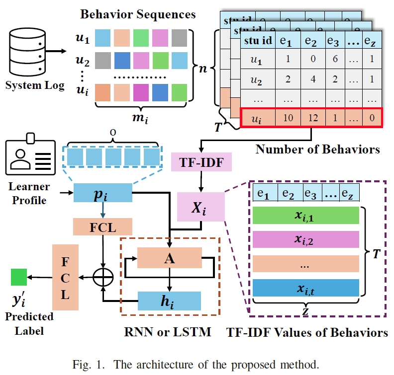

# Early Prediction Method for Learners at Risk Based on Multi-source Feature Fusion

This project contains the experimental code for the paper *Early Prediction Method for Learners at Risk Based on Multi-source Feature Fusion*.

Early identification of at-risk learners is crucial for improving learning outcomes in Massive Open Online Courses (MOOCs). This paper presents an early prediction method for identifying such learners using multi-source feature fusion, aiming to enhance the accuracy of risk detection in MOOCs. The proposed method incorporates a TF-IDF algorithm to effectively evaluate the significance of learning behavior data and integrates learners’ profile information with behavioral features, which are then processed by a sequential model for risk prediction. Furthermore, explainable AI techniques are employed to reveal the key factors influencing the predictions and diagnose the underlying causes of academic risk. Experimental results on real-world datasets demonstrate that the method significantly outperforms traditional machine learning models in early prediction, particularly during the one to ten week period. This research provides a robust approach to predicting at-risk learners, offering valuable insights for developing personalized educational interventions and contributing to improved completion rates in MOOCs.




## 📌 Steps to Run

1. **Data Preprocessing**
   - Run `01-data_process.py`, which will automatically process the data and convert the raw dataset into the required format for model execution.
   
2. **Model Training**
   - Run `02-model_train.py`, which will automatically train various models.
   - To switch between models, modify the `MODEL_NAME` variable in the script, for example:
     ```python
     MODEL_NAME = 'RFC'  # Select different models such as 'SVM', 'XGBoost', etc.
     ```

3. **Explainability Analysis**
   - Run `03-shap_analysis.py` to perform SHAP explainability analysis for a specific student.

⚠ **Note**:
Since the uploaded data is only a subset, you need to replace the current `studentVle_sample.csv` with the full dataset's `studentVle.csv`.
The complete dataset can be downloaded from the [Open University Learning Analytics Dataset](https://analyse.kmi.open.ac.uk/open-dataset).

---

## ⚙ Runtime Environment

### 📌 Python Version
- **Python 3.8**

### 📌 Key Dependencies
Make sure to install the following dependencies (recommended: use `pip install -r requirements.txt`):

```bash
pandas==0.25.1  
scikit-learn==1.0.2  
scipy==1.3.1  
tqdm==4.66.5  
torch==1.13.1  
numpy==1.17.2  
```

---

## 📄 License
This project is for academic research purposes only. Please refer to the relevant paper or contact the authors for specific licensing information.

If this project contributes to your research, please cite our paper!
